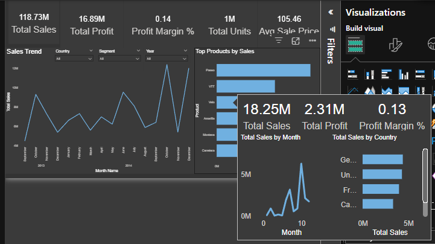

# powerbi-retail-kpi-dashboard

An executive-style **Power BI KPI dashboard** built on Microsoft's sample retail-style dataset (the classic **Financial Sample**), designed to demonstrate end-to-end BI skills: **data modeling, DAX, Top-N analysis, slicers, and custom tooltip drill-ins**.

> **Live demo (Power BI view link):** https://app.powerbi.com/view?r=eyJrIjoiYWU5YTM4YjItNzQ0MC00MjA5LWI2NTgtODUzZjc3MDhjZGVmIiwidCI6IjlkZGFhY2ExLTM4OWYtNGNiMS1hMTEzLTA4MWJlNmNjMjVmYyIsImMiOjZ9&pageName=c3e0b2b0800d1914666c

> **Portfolio page:** https://jamestsusanto.wordpress.com/power-bi-executive-kpi-dashboard-financial-performance/

---

## What this dashboard includes

### KPIs (DAX measures)
- **Total Sales**
- **Total Profit**
- **Profit Margin %**
- **Total Units**
- **Avg Sale Price**

### Visuals & interactions
- **Sales Trend** over time
- **Top Products by Sales** (Top-N)
- **Slicers:** Year / Segment / Country
- **Custom tooltip page:** hover over a product to see mini KPIs + a tiny trend + breakdown

---

## Repository contents

- `pbix/Retail_Analysis.pbix` – the Power BI report file
- `assets/` – screenshots/GIFs for GitHub + portfolio 
- `docs/` – executive summary + reproducibility notes
- `data/` – source data (Power BI Financial Sample.xlsx)

---

## How to run locally

### Prerequisites
- **Power BI Desktop** (Windows)

### Open the report
1. Download this repo (Code → Download ZIP) or clone it:
   ```bash
   git clone https://github.com/<your-username>/powerbi-retail-kpi-dashboard.git
   ```
2. Open `pbix/Retail_Analysis.pbix` in **Power BI Desktop**.

### Refresh data (if needed)
This report is based on the **Financial Sample** dataset. If you open the PBIX and see refresh warnings, you can:
- Replace the source by loading the Financial Sample Excel file, then map fields accordingly, **or**
- Use *Get data → Excel* and re-point the query.

See `docs/reproducibility.md` for step-by-step notes.

---

## Reproducibility notes (for recruiters)

This project uses a **standard Microsoft sample dataset** intentionally to keep the focus on:
- clean KPI definitions (DAX),
- dashboard layout & UX,
- interactive analysis patterns (Top-N + slicers),
- tooltips for drill-in context.

---

## Screenshots

## Preview




[](assets/demo.mp4)

---

## License
MIT – see [LICENSE](LICENSE).
